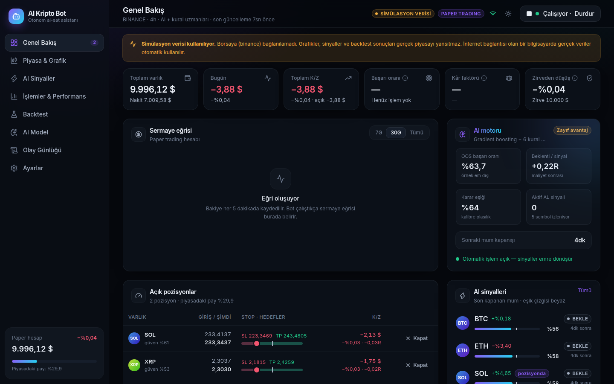
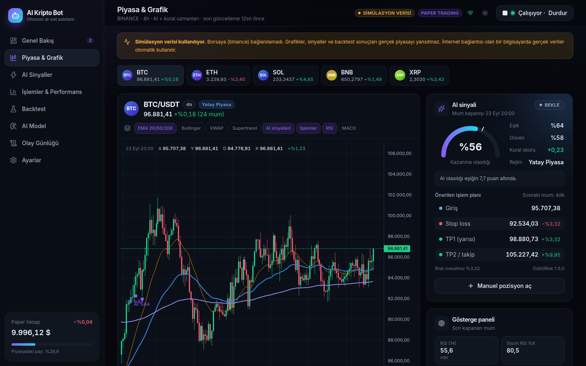
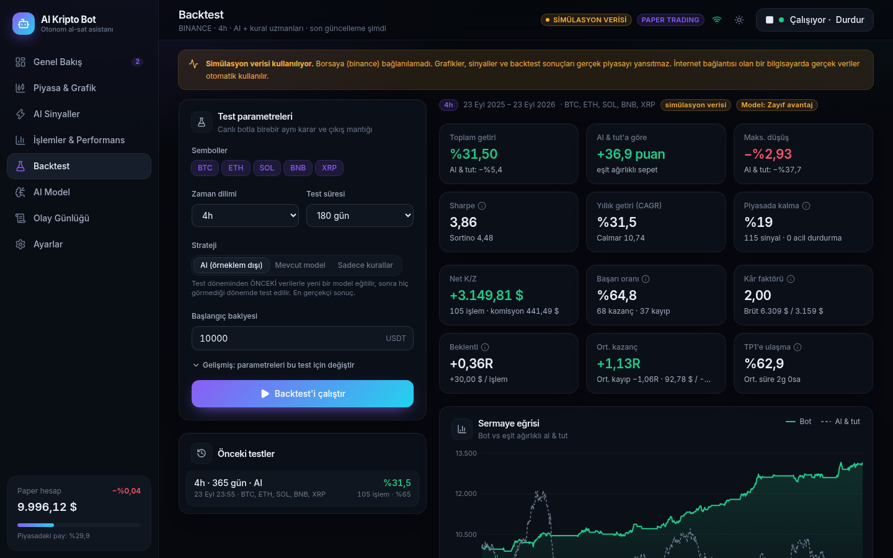
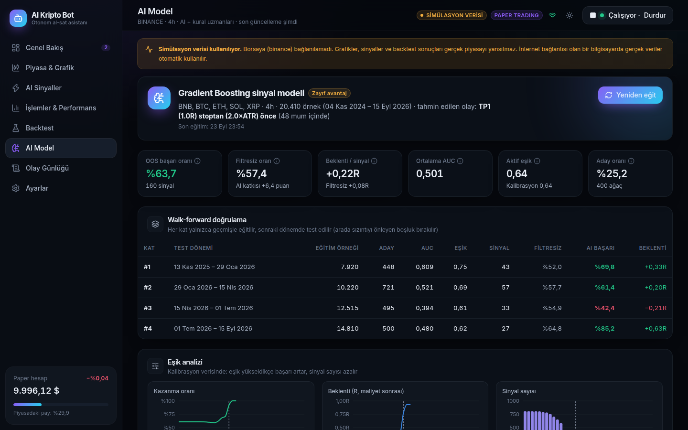

# AI Kripto Bot 🤖📈

Yapay zekâ destekli, otomatik kripto para **al-sat botu** ve modern bir kontrol paneli.
Bot; teknik göstergeleri, 6 kural tabanlı "uzmanı" ve örneklem dışı doğrulanmış bir makine öğrenmesi
modelini birleştirerek **yalnızca yüksek olasılıklı** fırsatlarda işlem açar, riskini her an yönetir
ve yaptığı her şeyi detaylı verilerle gösterir.


<sub>Ekran görüntüleri çevrimdışı simülasyon verisiyle alınmıştır.</sub>

> ⚠️ **Önemli risk uyarısı:** Hiçbir bot veya yapay zekâ kâr garantisi veremez. Kripto piyasaları çok
> oynaktır ve paranızın tamamını kaybedebilirsiniz. Bu yazılım **yatırım tavsiyesi değildir**.
> Önce **paper (sanal para)** modunda en az birkaç hafta test edin, backtest sonuçlarını inceleyin ve
> canlıya yalnızca kaybetmeyi göze alabileceğiniz küçük bir tutarla geçin.

---

## İçindekiler

- [Özellikler](#özellikler)
- [Hızlı başlangıç](#hızlı-başlangıç)
- [Canlı işleme geçiş (gerçek para)](#canlı-işleme-geçiş-gerçek-para)
- [Bot nasıl çalışır?](#bot-nasıl-çalışır)
- ["Başarı oranı" hakkında dürüst bilgi](#başarı-oranı-hakkında-dürüst-bilgi)
- [Ekranlar](#ekranlar)
- [Önemli ayarlar](#önemli-ayarlar)
- [Sorun giderme / SSS](#sorun-giderme--sss)
- [Geliştiriciler için](#geliştiriciler-için)

---

## Özellikler

**Yapay zekâ ve strateji**
- 🧠 **Gradient Boosting modeli** (scikit-learn): ~70 özellikten "fiyat stoptan önce hedefe ulaşır mı?" olasılığını tahmin eder.
- 🧪 **Walk-forward doğrulama:** Model 4 ayrı dönemde yalnızca geçmişle eğitilip hiç görmediği gelecekte test edilir. Ekranda gördüğünüz başarı oranları bu **örneklem dışı** testlerden gelir.
- 🎯 **Kalibre olasılık + otomatik eşik:** Komisyon ve kayma düşüldükten sonra beklentiyi en yüksek yapan eşik seçilir. **Model avantaj bulamazsa bot işlem açmaz** (sermaye koruması).
- 👥 **6 kural uzmanı:** Trend (EMA dizilimi), Momentum (MACD/RSI), Ortalamaya dönüş (RSI/Bollinger), Kırılım (Donchian + hacim), Hacim/para akışı (OBV/MFI), Supertrend/VWAP — piyasa rejimine göre ağırlıklandırılır.
- 🌐 **Piyasa rejimi ve BTC filtresi:** Yükseliş / düşüş / yatay / aşırı volatil rejim tespiti. BTC düşüş trendindeyken altcoin alınmaz.
- 💬 **AI Analist (isteğe bağlı, Claude):** Botun verilerini Türkçe olarak yorumlar — fırsatlar, riskler, senaryolar, izlenecek seviyeler. İşlem kararlarını **etkilemez**.

**Risk yönetimi (başarı oranını yükselten kısım)**
- 📏 Her işlemde bakiyenin sabit bir yüzdesini riske atan **pozisyon boyutlama** (varsayılan %1).
- 🛑 ATR tabanlı **stop loss**, **TP1'de yarı kâr alma + stopu başabaşa çekme**, TP2 hedefi ve **takip eden stop**.
- ⏱️ Zaman stopu, sinyal dönünce çıkış, zarar sonrası bekleme süresi.
- 🚨 **Günlük zarar limiti** ve **maksimum düşüşte acil durdurma** (tüm pozisyonları kapatır, botu durdurur).

**Kontrol paneli**
- 📊 Canlı sermaye eğrisi, K/Z, başarı oranı, kâr faktörü, beklenti (R), düşüş
- 🕯️ TradingView grafikleri: EMA, Bollinger, VWAP, Supertrend, RSI, MACD, AI sinyalleri, işlem işaretleri, pozisyon seviyeleri
- ⚡ Her coin için AI olasılık göstergesi, uzman oyları ve **karar gerekçeleri**
- 🧾 İşlem geçmişi, R dağılımı, sembol/rejim/çıkış nedeni analizleri, aylık getiri ısı haritası, CSV dışa aktarma
- 🔬 **Backtest:** canlı botla birebir aynı mantık; al-tut karşılaştırması, Sharpe/Sortino/CAGR, düşüş grafiği
- 🌗 Koyu/açık tema, mobil uyumlu, gerçek zamanlı (WebSocket) güncelleme ve bildirimler

---

## Hızlı başlangıç

### Gereksinimler
- **Python 3.10+** → <https://www.python.org/downloads/> (Windows'ta kurulumda **"Add Python to PATH"** kutusunu işaretleyin)
- (İsteğe bağlı) **Node.js 20+** — yalnızca arayüzü kendiniz yeniden derlemek isterseniz. Derlenmiş arayüz depoda hazır gelir.

### Windows
1. [python.org](https://www.python.org/downloads/)'dan Python'u kurun. Kurulumun ilk ekranında
   **"Add python.exe to PATH"** kutusunu işaretleyin. (Microsoft Store'daki "python" kısayolu çalışmaz.)
2. Depoyu indirin (yeşil **Code → Download ZIP**) ve kısa, Türkçe karakter içermeyen bir klasöre çıkarın
   (ör. `C:\kripto-bot`).
3. **`baslat.bat`** dosyasına çift tıklayın. Mavi "Windows bilgisayarınızı korudu" uyarısı çıkarsa
   **Ek bilgi → Yine de çalıştır** deyin.
4. **İlk açılışta** gerekli paketler indirilir (~150 MB, 2-5 dakika). Siyah pencerede ilerleme görünür —
   **pencereyi kapatmayın**.
5. Sunucu hazır olunca panel tarayıcıda kendiliğinden açılır: <http://127.0.0.1:8000>. İlk açılışta AI modeli
   arka planda otomatik eğitilir. Botu durdurmak için siyah pencereyi kapatın.

### macOS / Linux
```bash
git clone <depo-adresi> && cd log
./baslat.sh          # veya: python3 baslat.py
```

### Docker
```bash
cp .env.example .env
docker compose up -d --build
# http://127.0.0.1:8000
```

### İlk kullanım
1. **Genel Bakış** sayfasında AI motorunun eğitimini bekleyin ("Model eğitildi" bildirimi gelir).
2. **Backtest** sayfasında "AI (örneklem dışı)" ile 180–365 günlük test yapın; sonuçları inceleyin.
3. **Ayarlar**'da semboller, risk ve çıkış kurallarını isteğinize göre düzenleyin.
4. Sağ üstteki **Botu Başlat** ile paper modda otomatik işlemi başlatın. Bot yalnızca açık kaldığı sürece çalışır.

---

## Canlı işleme geçiş (gerçek para)

Canlı mod bilinçli olarak üç kilitle korunur:

1. **Borsada API anahtarı oluşturun.** Binance: *Profil → API Yönetimi*.
   - ✅ Yalnızca **"Spot & Marjin İşlem"** (sadece spot) iznini açın.
   - ❌ **"Para çekme" iznini asla açmayın.**
   - 🔒 Mümkünse **IP kısıtlaması** ekleyin.
2. Proje klasöründeki **`.env`** dosyasını düzenleyin:
   ```env
   EXCHANGE=binance
   EXCHANGE_API_KEY=...
   EXCHANGE_API_SECRET=...
   ENABLE_LIVE_TRADING=true
   ```
3. Uygulamayı yeniden başlatın, **Ayarlar → İşlem modu → Canlı** seçip kaydedin, sonra **Botu Başlat**'a basın ve uyarıyı onaylayın.

> **Stoplar bot tarafından yönetilir** (yazılımsal stop). Bot kapalıyken veya internet kesikken stoplar
> çalışmaz. Botu sürekli açık kalan bir bilgisayarda/sunucuda çalıştırın.
> Bot yalnızca **spot** işlem yapar: kaldıraç ve açığa satış yoktur (en fazla yatırdığınız kadar kaybedebilirsiniz).

Desteklenen borsalar: [ccxt](https://github.com/ccxt/ccxt)'nin desteklediği tüm spot borsalar
(`binance`, `bybit`, `okx`, `kucoin`, `gateio`, `btcturk` …). Varsayılan ve en çok test edilen: **Binance**.

---

## Bot nasıl çalışır?

Her **mum kapanışında** (varsayılan 4 saatlik) her coin için şu adımlar çalışır:

```
Mum verisi ─► 30+ gösterge ─► 6 uzman oyu + piyasa rejimi ─► Giriş filtreleri ─► AI olasılığı ─► Karar
                (EMA, RSI, MACD,    (rejime göre ağırlık)      (trend, BTC,          (kalibre)       AL / BEKLE / ÇIK
                 ATR, ADX, OBV...)                              volatilite, hacim)
```

1. **Göstergeler:** EMA 9/20/50/100/200, RSI, Stoch RSI, MACD, Bollinger, ATR, ADX/DI, OBV, MFI, CCI, Donchian, Supertrend, VWAP, hacim z-skoru.
2. **Uzmanlar ve rejim:** 6 uzman −1 (sat) ile +1 (al) arası oy verir; ağırlıklar rejime göre değişir (ör. yatay piyasada ortalamaya dönüş uzmanı daha etkilidir).
3. **Giriş filtreleri (aday):** coin veya BTC düşüş trendinde değil, volatilite aşırı değil, hacim yeterli ve kural skoru eşiğin üzerinde.
4. **AI kararı:** Model, adayın **TP1 hedefine stoptan önce ulaşma olasılığını** hesaplar. Olasılık, doğrulamada seçilen eşiği geçerse **AL**.
5. **İşlem:** Sinyal kapanan mumda oluşur, emir **bir sonraki mumun açılışında** verilir (backtest ile birebir aynı). Pozisyon boyutu, stop olunursa bakiyenin en fazla ~%1'i kaybedilecek şekilde hesaplanır.
6. **Pozisyon yönetimi:**
   - Stop = giriş − 2×ATR (**1R**)
   - **TP1 = +1R** → pozisyonun %50'si satılır, stop **başabaşa** çekilir (işlem artık zararla kapanamaz)
   - **TP2 = +3R** veya **takip eden stop** (zirve − 2×ATR) ile kalan kısım kapanır
   - TP1'e ulaşamayan işlemler 48 mum sonra kapanır (zaman stopu)

### AI modeli
- **Etiket (üçlü bariyer):** "Bir sonraki mumun açılışında alsaydım, fiyat stoptan önce TP1'e ulaşır mıydı?" — botun gerçek çıkış kuralıyla aynı.
- **Özellikler:** getiriler (1–192 mum), osilatörler, trend uzaklıkları, volatilite, hacim, mum yapısı, uzman oyları, rejim ve **BTC piyasa bağlamı** (altcoinler BTC'yi takip eder). Hepsi ölçekten bağımsızdır; tüm coinler tek modelde birlikte öğrenilir.
- **Doğrulama:** Arada boşluk bırakılmış (purged) **walk-forward**; olasılıklar Platt ölçeklemesiyle kalibre edilir; eşik, komisyon sonrası beklentiye göre seçilir.
- **Güvenlik kilidi:** Hem walk-forward testleri hem son kalibrasyon **pozitif beklenti** göstermezse model "Avantaj yok" olarak işaretlenir ve **AI işlem açmaz**.
- Model varsayılan olarak **her 24 saatte** en güncel verilerle otomatik yeniden eğitilir.

---

## "Başarı oranı" hakkında dürüst bilgi

Botun tasarımı başarı oranını (kârla kapanan işlem yüzdesi) yükseltmeye odaklanır:
- AI yalnızca en yüksek olasılıklı adaylarda işlem açar (az ama seçici işlem),
- TP1'de kısmi kâr alınıp stop başabaşa çekildiği için **TP1'e ulaşan her işlem kârla kapanır**,
- trend ve BTC filtreleri düşen piyasada alım yapmayı engeller.

Ancak:
- **Başarı oranı tek başına yeterli değildir.** Önemli olan *beklentidir* (işlem başına ortalama kazanç, R cinsinden) ve *kâr faktörüdür*. Panel hepsini gösterir.
- Gösterilen oranlar **geçmiş veride örneklem dışı** ölçülmüştür; gelecekte farklı olabilir. Piyasa koşulları değişir.
- Daha yüksek eşik → daha yüksek başarı oranı ama daha az işlem (ve genellikle daha düşük toplam getiri). Backtest ile kendi tercihinizi bulun.
- Komisyon ve kayma tüm testlere dahildir. Kısa zaman dilimlerinde (15m, 1h) maliyetlerin riske oranı yükselir; **4h** bu yüzden varsayılandır.

---

## Ekranlar

| Sayfa | İçerik |
|---|---|
| **Genel Bakış** | Bakiye, günlük/toplam K/Z, başarı oranı, kâr faktörü, düşüş; sermaye eğrisi; AI motoru durumu; açık pozisyonlar; sinyal listesi; canlı olay akışı |
| **Piyasa & Grafik** | Mum grafiği + katmanlar, AI olasılık göstergesi, önerilen işlem planı (giriş/SL/TP1/TP2), gösterge paneli, uzman oyları, karar gerekçeleri, AI Analist |
| **AI Sinyaller** | Tüm coinlerin olasılık/rejim/kural skoru kartları veya tablosu |
| **İşlemler & Performans** | Detaylı istatistikler, R dağılımı, sembol/rejim/çıkış analizleri, aylık getiri, CSV |
| **Backtest** | Örneklem dışı AI / mevcut model / sadece kurallar karşılaştırmalı testler |
| **AI Model** | Walk-forward katları, eşik analizi, en etkili özellikler, yeniden eğitim |
| **Olay Günlüğü** | Botun her kararı, emri ve uyarısı |
| **Ayarlar** | Mod, semboller, risk, çıkış stratejisi, AI eşikleri, maliyetler, paper hesap |





---

## Önemli ayarlar

| Ayar | Varsayılan | Açıklama |
|---|---|---|
| Zaman dilimi | `4h` | Sinyaller bu mumların kapanışında hesaplanır |
| Semboller | BTC, ETH, SOL, BNB, XRP | USDT pariteleri; model hepsinde ortak eğitilir |
| İşlem başına risk | %1 | Stop olunursa kaybedilecek bakiye oranı (%0,5–1 önerilir) |
| Maks. açık pozisyon | 3 | Aynı anda en fazla pozisyon sayısı |
| Stop mesafesi | 2 × ATR | 1R'yi belirler |
| TP1 / TP2 | 1R / 3R | TP1'de %50 kâr alınır |
| Takip eden stop | 2 × ATR | TP1 sonrası devreye girer |
| AI eşiği | 0 (otomatik) | 0 = modelin doğrulamada seçtiği eşik |
| Günlük zarar limiti | %3 | Aşılırsa o gün yeni işlem açılmaz |
| Maks. düşüş | %15 | Aşılırsa her şey kapatılır, bot durur |
| Komisyon / kayma | %0,1 / %0,03 | Backtest ve eğitimde kullanılır |

Gizli anahtarlar ve sistem ayarları `.env` dosyasındadır (bkz. [`.env.example`](.env.example)).

---

## Sorun giderme / SSS

**`baslat.bat` hata verdi / açılıp kapanıyor / hiçbir şey yazmıyor.**
Başlatıcı her adımda ne yaptığını yazar ve hata olursa pencereyi açık tutar. Sırasıyla kontrol edin:
- *"Python bulunamadı"* → Python'u python.org'dan **"Add python.exe to PATH"** işaretli kurun.
- *Paket kurulumu yarıda kaldı* → `baslat.bat`'ı tekrar çalıştırmanız yeterli; yarım kurulum otomatik onarılır.
- *"Port kullanılıyor"* → Bot zaten açıksa başlatıcı paneli açar; başka bir program kullanıyorsa `.env`
  içinde `PORT=8001` yapın.
- Sorun sürerse siyah pencerenin ekran görüntüsünü ve `backend\data\bot.log` dosyasını paylaşın.

**Tarayıcıda "Bu siteye ulaşılamıyor" yazıyor.**
Sunucu henüz hazır değil veya kapalı. Siyah pencerede **"Panel hazır"** yazısını bekleyip sayfayı yenileyin.
Pencereyi kapattıysanız bot da kapanır; `baslat.bat`'ı yeniden çalıştırın.

**Panelde "SİMÜLASYON VERİSİ" yazıyor.**
Borsaya bağlanılamadı (internet, güvenlik duvarı veya bölgesel erişim engeli). Bu durumda uygulama
deterministik bir simülasyon piyasasıyla çalışır; sonuçlar gerçek piyasayı yansıtmaz. Borsaya
erişilebilen bir ağda gerçek veriler otomatik kullanılır. Binance erişilemiyorsa `.env` içinde
`EXCHANGE=bybit` / `okx` / `kucoin` / `btcturk` deneyin.

**Bot hiç işlem açmıyor.**
Normal olabilir: bot seçicidir. Kontrol edin: (1) Botu Başlat'a bastınız mı? (2) AI Model sayfasında
"Avantaj yok" mu yazıyor? — o zaman model sermayeyi korumak için işlem açmaz; yeniden eğitmeyi,
4h zaman dilimini veya farklı sembolleri deneyin. (3) Sinyal kartlarındaki gerekçelerde "Trend
filtresi aktif" gibi engeller var mı? 4h grafikte günde en fazla 6 karar anı vardır.

**Bilgisayarı kapatırsam ne olur?**
Bot durur; açık pozisyonlar borsada kalır ama stoplar/hedefler çalışmaz. Açtığınızda kaldığı yerden
devam eder. Sürekli çalıştırmak için bir VPS/sunucu ve Docker önerilir.

**Paneli telefondan açabilir miyim?**
Evet. `.env` içinde `HOST=0.0.0.0` ve mutlaka bir `DASHBOARD_TOKEN` belirleyin; aynı ağdaki
telefondan `http://<bilgisayar-ip>:8000` adresini açın. İnternete açacaksanız HTTPS ters vekil
(ör. Caddy) kullanın.

**AI Analist çalışmıyor.**
`.env` dosyasına `ANTHROPIC_API_KEY` ekleyip uygulamayı yeniden başlatın. Model `ANTHROPIC_MODEL`
ile değiştirilebilir (varsayılan `claude-opus-5`).

---

## Geliştiriciler için

### Proje yapısı
```
backend/                  Python (FastAPI) — bot motoru ve API
  app/
    main.py               REST + WebSocket API, arayüzü sunar
    engine.py             Canlı işlem döngüsü, risk kontrolleri, olaylar
    strategy.py           Sinyal çerçevesi (canlı ve backtest ortak), açıklamalar
    experts.py            6 kural uzmanı ve piyasa rejimi
    indicators.py         Teknik göstergeler (pandas, TA-Lib gerektirmez)
    features.py           ML özellikleri, BTC bağlamı, üçlü bariyer etiketleri
    ai_model.py           Gradient boosting, walk-forward, kalibrasyon, eşik seçimi
    trading.py            Pozisyon modeli, çıkış kuralları, pozisyon boyutlama
    backtest.py           Olay güdümlü portföy backtest motoru
    metrics.py            Performans istatistikleri
    broker.py             Paper ve canlı (ccxt) emir yürütme
    market.py             Borsa verisi (ccxt) + simülasyon beslemesi
    analyst.py            Claude ile AI Analist (isteğe bağlı)
    db.py                 SQLite kalıcılık
  tests/                  pytest testleri
frontend/                 React + TypeScript + Vite + Tailwind arayüz
  src/pages/              Sayfalar
  src/components/         Grafikler (lightweight-charts, Recharts) ve UI bileşenleri
```

### Geliştirme ortamı
```bash
# Arka uç
cd backend
python -m venv .venv && source .venv/bin/activate   # Windows: .venv\Scripts\activate
pip install -r requirements-dev.txt
python -m pytest            # testler
python -m app.main          # http://127.0.0.1:8000

# Arayüz (canlı yeniden yükleme, API'yi 8000'e yönlendirir)
cd frontend
npm install
npm run dev                 # http://localhost:5173
npm run build               # frontend/dist üretir (depoda derlenmiş hali bulunur)
```

İnternet erişimi olmadan geliştirmek için `DATA_SOURCE=demo` kullanın.

### API
| Yöntem | Yol | Açıklama |
|---|---|---|
| GET | `/api/state` | Anlık durum (hesap, pozisyonlar, sinyaller, model) |
| WS | `/ws` | Gerçek zamanlı durum ve olay akışı |
| POST | `/api/bot/start` · `/api/bot/stop` · `/api/bot/reset-halt` | Bot kontrolü |
| GET/PUT | `/api/config` | Ayarlar |
| GET | `/api/signal?symbol=` · `/api/candles?symbol=` | Sinyal detayı, grafik verisi |
| POST | `/api/positions/open` · `/api/positions/close` | Manuel pozisyon |
| GET | `/api/trades` · `/api/performance` · `/api/events` | Geçmiş ve istatistikler |
| GET/POST | `/api/model` · `/api/model/train` | Model bilgisi ve eğitim |
| POST/GET | `/api/backtest` · `/api/backtest/{id}` · `/api/backtests` | Backtest |
| POST | `/api/analyze` | AI Analist yorumu |

`DASHBOARD_TOKEN` ayarlıysa tüm istekler `Authorization: Bearer <token>` başlığı gerektirir.

---

Lisans ve sorumluluk: Yazılım "olduğu gibi" sunulur. Kullanımından doğan kazanç veya kayıplardan
geliştirici sorumlu değildir.
